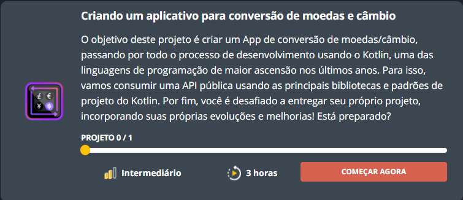
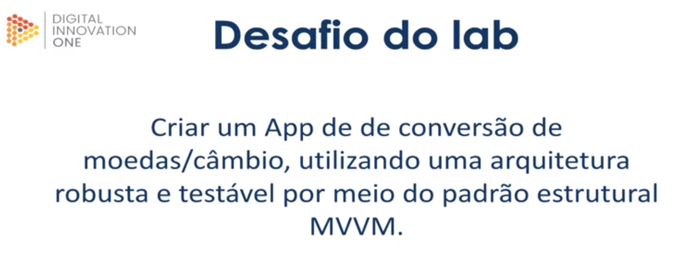

<h1 style="text-align:center">Bootcamp Dio-Carrefour Android Developer</h1>

início: 26/08/21 qui    Final: 09/02/22 qua                                               data1: 24/10/21 dom (adiada) 

- dashboard: https://web.digitalinnovation.one/track/carrefour-android-developer-1?tab=path

<u>Dúvidas:</u>  contato@digitalinnovation.one

=======================================================================================

<h3><u>Modulo25-Criando App Conversor de Moedas e Câmbio</u></h3> 

29/10/21 sex

- Descrição da atividade:

<h3>Como usar os desafios do projeto para criar seu portfólio</h3>

- Apresentação da atividade (vídeo)

( F:\Meus Documentos\JH\DIO\3- CarrefourAndroidDev\Modulo21-CriandoAppDeLembretesETarefas\VideoAulas\Atividade01- OProjetoESeuPortfolio)

<h2><u>1- Aulas</u></h2>

<h3>Aula1- Apresentação</h3>

- Instrutor: Ezequiel Messore - Desenvolvedor Android / Koike Tecnologia
- https://www.linkedin.com/in/ezequielmessore/
- https://github.com/EzequielMessore

01/11/21 seg

<h3>Aula2- Projeto Base</h3>

(https://github.com/EzequielMessore/coin-converter)

<h4>Etapa1 - Conhecendo o projeto</h4>

- <u>base do projeto</u> :

  - <u>gradle</u> : dependências do projeto (links para os documentos-explicativos dessas dependências)

  

  

  -retrofit : ( https://square.github.io/retrofit/ ) a type-safe <b>HTTP client</b> for Android and Java;

  

  -koin : ( https://insert-koin.io/docs/quickstart/android/ ) a pragmatic lightweight <b>dependency injection framework</b> for Kotlin developers;

  (https://medium.com/collabcode/inje%C3%A7%C3%A3o-de-depend%C3%AAncia-no-kotlin-com-koin-4d093f80cb63)

  

  -coroutine : ( https://developer.android.com/kotlin/coroutines )  é um padrão de projeto de <b>simultaneidade</b> que se pode usar no Android para simplificar o código que é executado de forma <b>assíncrona</b>; é equivalente a uma thread, porém é sequencial e não precisa de callback;

  

  -Lifecycle : ( https://developer.android.com/topic/libraries/architecture/lifecycle?hl=pt-Br#lc , https://developer.android.com/reference/androidx/lifecycle/Lifecycle?hl=pt-Br ) é uma <b>classe</b> que contém as <b>informações sobre o estado do ciclo de vida de um componente</b> (como uma atividade ou um fragmento) e permite que outros objetos observem esse estado;

  

  

  -room :  ( https://developer.android.com/training/data-storage/room ) o banco de dados Room oferece uma <b>camada de abstração sobre o SQLite</b> para permitir acesso fluente ao banco de dados e, ao mesmo tempo, aproveita toda a capacidade do SQLite.

  
  
  (mais links no documento do projeto no github F:\Meus Documentos\JH\DIO\3- CarrefourAndroidDev\Modulo25-CriandoAppConvMoedasECambio\coin-converter\readme.md.
  
  

- <u>Componentes da arquitetura Android</u> (https://developer.android.com/topic/libraries/architecture/ e

   https://developer.android.com/jetpack/guide ) : são bibliotecas para o projeto de apps robustas, testáveis e de fácil manutenção;

  Componentes utilizados no app exemplo do bootcamp:

  - <u>viewModel</u> : armazena os dados relacionados à IU que <b>não são destruídos</b> em rotações de apps;

  - <u>LiveData</u>     : objetos de dados que <b>notificam as activities</b> quando o banco de dados subjacente é modificado;

  - <u>Repository</u> : class to <b>manage multiple data sources</b>;

    (https://medium.com/swlh/repository-pattern-in-android-c31d0268118c)

    

    

  <b>Padrão estrutural MVVM</b> (Model-View-ViewModel) :

  

  - <u>View</u> : mostra os dados e gerencia a interação com o usuário;
  - <u>ViewModel</u> : tratará os requests e fornecerá todos os dados necessários ao View e
  - <u>Model</u> : armazenará os dados e tratará as lógicas do negócio.

  - <u>diagrama funcional do projeto</u> :

  

  

  

  - <u>estrutura do projeto</u> :

<h3>Aula3- Tela do app: conversão de moedas</h3> (layout/activity_main) 

<h3>Aula4- Concluindo as views</h3>

02/11/21 ter

<h3>Aula5- Implementando o DataModule</h3> --> Nível: avançado (!!!) - difícil ...

( data\di\DataModule.kt : <i>networkModule()</i> + <i>repositoryModule()</i> + <i>databaseModule()</i> )

- codificando as injeções de dependências (koin);
  - módulos, tipos : single e factoring
  - create services

<h3>Aula6- Implementando o UseCases (Coroutines), RestAPI</h3> ( awesomeService.kt + app.kt )

<b><u>UseCase.kt</u></b> :

package br.com.dio.coinconverter.core

import kotlinx.coroutines.flow.Flow

//--- Declara a Corotina class
<b>abstract class</b> UseCase<Param, Source> {

​	//--- Método execute
​	<b>abstract suspend</b> fun execute(param: Param): Flow<Source>

​	//--- Método invoke
​	<b>open suspend operator</b> fun invoke(param: Param) = execute(param)

​	//--- Declara uma rotina interna à corotina: NoParam
​	abstract class NoParam<Source> : UseCase<None, Flow<Source>>() { 

​		//--- Método execute	
​		abstract suspend fun execute(): Flow<Source>	

​		//--- Método execute se param for igual a None na chamada do método execute
​		final override suspend fun execute(param: None) = throw UnsupportedOperationException()

​		//--- Método invoke
​		suspend operator fun invoke(): Flow<Source> = execute()

​	}

​	//--- Declara uma rotina interna à corotina: NoSource 
​	abstract class NoSource<Params> : UseCase<Params, Unit>() { 

​		//--- Método invoke
​		override suspend operator fun invoke(param: Params) = execute(param)

​	}

​	//--- Retorna um objeto None
​	object None

}

- <b><i><u>abstract</u></i></b> is a keyword that indicates that a function can't be instantiated directly (you can't create objects from this class), but its subfunctions coud be inherited;
- <b><i><u>suspend</u></i></b> is a keyword that indicates that a function can be paused and resumed;
- <b><i><u>operator</u></i></b> is a keyword that indicates that a function can be marks a function as overloading an operator or implementing a convention (https://kotlinlang.org/docs/operator-overloading.html);
- <b><i><u>open</u></i></b> is a keyword that indicates that a function can be herdada;

<h3>Aula7- ViewModel</h3> ( presentation\di\PresentationModule.kt )

<h3>Aula8- Customizando a view</h3> (primeiros testes com o app)

<h3>Aula9- Tratando erros na API do Android</h3> (try-catch; throwable; customException)

03/11/21 qua 
<h3>Aula10- Configurando o Banco de Dados</h3>

<h3>Aula11- History Activity</h3>

<h3>Aula12- Finalizando o histórico</h3>( \layout\history_activity.xml e \layout\item_history.xml)

<h2><u>2- Projeto final</u></h2>

- renomeado para DIO-CoinConverter
- criado o repositório no GitHub

<h3><u>2.1- Rodando o app</u></h2>(--> OK!)

<h3><u>2.2- Entendendo a implementação</u></h2>

